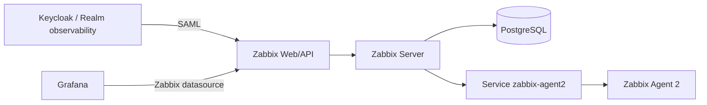

# zabbix-gitops

Stack Zabbix 7.4 para laboratório OpenShift Local: servidor, frontend,
PostgreSQL 16 e Agent 2. O overlay `desenvolvimento` usa réplicas únicas e
recursos reduzidos; não é um desenho de alta disponibilidade.

## Arquitetura



Este repositório entrega a plataforma Zabbix e a autenticação centralizada via
Keycloak. O bootstrap foi mantido deliberadamente simples: ele configura SAML,
certificado IdP e, opcionalmente, o usuário/Secret consumido pelo datasource do
Grafana. Ele não importa templates, não cria hosts, não altera host groups de
monitoramento e não renomeia objetos padrão do Zabbix.

## Pré-requisito

```bash
oc new-project zabbix
oc -n zabbix create secret generic zabbix-db \
  --from-literal=username=zabbix \
  --from-literal=password="$(openssl rand -base64 32)" \
  --from-literal=database=zabbix
oc apply -k overlays/desenvolvimento
```

## Bootstrap SAML e integração Grafana

Após a stack subir, execute o bootstrap idempotente:

```bash
cp .env.example .env
# defina ZABBIX_ADMIN_PASSWORD com a senha administrativa atual do Zabbix
scripts/bootstrap-zabbix.sh
```

O script faz:

- autentica na API do Zabbix sem imprimir credenciais;
- habilita SAML no Zabbix 7.4 apontando para o realm `observability` do
  Keycloak;
- extrai o certificado público SAML do metadata do Keycloak e cria/atualiza o
  ConfigMap `zabbix-saml-idp` com a chave `idp.crt`;
- habilita JIT provisioning SAML, usando atributos `username`, `firstName`,
  `lastName` e `groups`;
- habilita SCIM no diretório SAML quando `ZABBIX_ENABLE_SAML_SCIM=true`;
- mapeia grupos Keycloak para grupos/roles Zabbix;
- opcionalmente cria/atualiza o usuário técnico `grafana-datasource` e o Secret
  `grafana/zabbix-datasource`, quando `ZABBIX_MANAGE_GRAFANA_DATASOURCE=true`.

O script não provisiona hosts, templates, web scenarios, macros Kubernetes ou
inventário de monitoramento. Esses objetos devem ser configurados manualmente no
Zabbix ou por um processo dedicado, quando houver um desenho de monitoramento
mais maduro.

## Secrets

| Secret | Namespace | Chaves | Consumidor |
|---|---|---|---|
| `zabbix-db` | `zabbix` | `username`, `password`, `database` | PostgreSQL, Zabbix Server e Zabbix Web |
| `zabbix-datasource` | `grafana` | `username`, `password` | Grafana datasource Zabbix |

## ConfigMaps

| ConfigMap | Namespace | Chave | Consumidor |
|---|---|---|---|
| `zabbix-saml-idp` | `zabbix` | `idp.crt` | Zabbix Web SAML |

Criação/rotação do banco:

```bash
oc -n zabbix create secret generic zabbix-db \
  --from-literal=username=zabbix \
  --from-literal=password="${ZABBIX_DB_PASSWORD}" \
  --from-literal=database=zabbix \
  --dry-run=client -o yaml | oc apply --server-side -f -
```

Rotação do usuário técnico do Grafana:

```bash
ZABBIX_GRAFANA_PASSWORD="$(openssl rand -base64 36)" scripts/bootstrap-zabbix.sh
```

Rotação do certificado IdP SAML: rotacione a chave/certificado no Keycloak e
reexecute `scripts/bootstrap-zabbix.sh`. O script compara o conteúdo de
`idp.crt`, atualiza o ConfigMap e reinicia `deployment/zabbix-web` quando
`ZABBIX_RESTART_WEB_ON_IDP_CERT_CHANGE=true`.

## SSO via Keycloak

O Zabbix 7.4 suporta SAML para SSO. O script configura:

- IdP Entity ID: `${KEYCLOAK_BASE_URL}/realms/observability`;
- SSO/SLO URL: `${KEYCLOAK_BASE_URL}/realms/observability/protocol/saml`;
- SP Entity ID: `zabbix`;
- ACS: `${ZABBIX_BASE_URL}/index_sso.php?acs`.

O client SAML correspondente é mantido em `keycloak-gitops`.

O deployment `zabbix-web` monta `/etc/zabbix/web/certs/idp.crt` e define:

```text
ZBX_SSO_IDP_CERT=/etc/zabbix/web/certs/idp.crt
ZBX_SSO_SETTINGS={"baseurl":"<URL pública do Zabbix>","use_proxy_headers":true,"strict":true}
```

`use_proxy_headers` é necessário porque a Route do OpenShift termina TLS na
borda e encaminha a requisição HTTP para o container.

## JIT provisioning

O bootstrap configura JIT com os mappers SAML provisionados pelo
`keycloak-gitops`:

| Atributo SAML | Variável | Uso no Zabbix |
|---|---|---|
| `username` | `ZABBIX_SAML_LOGIN_ATTRIBUTE` | login/alias do usuário |
| `firstName` | `ZABBIX_SAML_FIRST_NAME_ATTRIBUTE` | nome |
| `lastName` | `ZABBIX_SAML_LAST_NAME_ATTRIBUTE` | sobrenome |
| `groups` | `ZABBIX_SAML_GROUP_ATTRIBUTE` | mapeamento de grupos |

Mapeamentos criados:

| Grupo Keycloak | Grupo Zabbix | Role |
|---|---|---|
| `zabbix-super-admins` | `Zabbix administrators` | `Super admin role` |
| `zabbix-admins` | `Zabbix administrators` | `Super admin role` |
| `zabbix-users` | `Grafana datasource readers` | `User role` |
| `zabbix-guests` | `Grafana datasource readers` | `User role` |

O grupo `Disabled provisioned users` é criado com `users_status=disabled` e
configurado em `disabled_usrgrpid`, permitindo desabilitar usuários
deprovisionados pelo IdP.

O client SAML do Keycloak emite o atributo `groups` sem caminho completo, por
isso os padrões acima não usam a barra inicial. As opções de assinatura ficam
conservadoras: o Zabbix valida assertions assinadas pelo IdP, mas não exige
criptografia nem assinatura de AuthN/logout requests enquanto não houver
certificado/chave de SP provisionados no frontend.

SCIM é habilitado no diretório SAML para ambientes que publicarem o endpoint e
um cliente SCIM compatível. No laboratório CRC, o caminho principal continua
sendo JIT no login; SCIM fica preparado para evolução sem armazenar token no Git.

## Datasource Grafana

Quando `ZABBIX_MANAGE_GRAFANA_DATASOURCE=true`, o bootstrap cria/atualiza:

- usuário `grafana-datasource`;
- grupo `Grafana datasource readers`;
- Secret `grafana/zabbix-datasource` com `username` e `password`.

Por padrão, o script não cria host groups de monitoramento e não concede leitura
a nenhum host group inexistente. Se você já tiver host groups manuais no Zabbix e
quiser liberar leitura para o datasource, informe:

```bash
ZABBIX_GRAFANA_READ_HOST_GROUPS="Linux servers,Templates"
scripts/bootstrap-zabbix.sh
```

## Validação

```bash
oc -n zabbix get pods,svc,route
oc -n zabbix get configmap zabbix-saml-idp
oc -n grafana get secret zabbix-datasource
curl -k "$(oc -n zabbix get route zabbix -o jsonpath='https://{.spec.host}')/api_jsonrpc.php"
```

## Ambientes

```bash
oc kustomize overlays/desenvolvimento >/tmp/zabbix-dev.yaml
oc kustomize overlays/aceite >/tmp/zabbix-aceite.yaml
oc kustomize overlays/producao >/tmp/zabbix-prod.yaml
oc apply --dry-run=client -k overlays/desenvolvimento
```

O Route da base não fixa host; OpenShift gera o domínio por cluster. Como SAML
exige `baseurl` estável, cada overlay define `ZBX_SSO_SETTINGS` com a URL
pública esperada do ambiente. Ajuste esse valor junto com o domínio real antes
de promover para aceite/produção. O script de bootstrap descobre Zabbix e
Keycloak por Route quando URLs não são informadas no `.env`.

Referências:

- https://www.zabbix.com/documentation/7.4/en/manual/installation/containers
- https://www.zabbix.com/documentation/7.4/en/manual/web_interface/frontend_sections/users/authentication/saml
- https://www.zabbix.com/documentation/7.4/en/manual/api/reference/userdirectory/create
