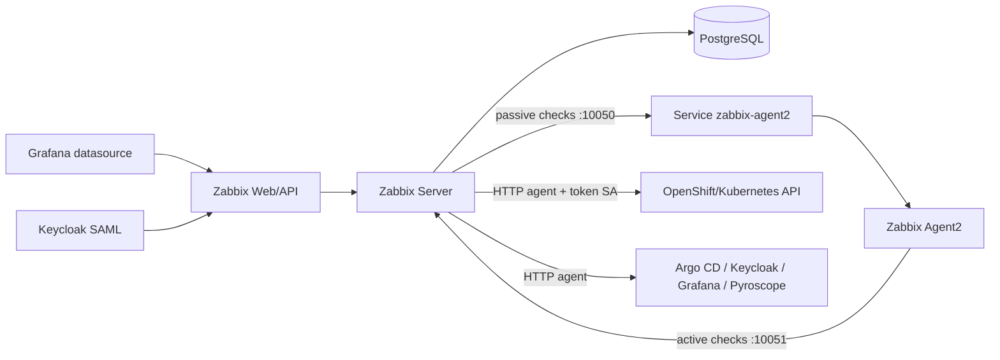

# zabbix-gitops

Stack Zabbix 7.4 para laboratório OpenShift Local: servidor, frontend,
PostgreSQL 16 e Agent 2. O overlay `desenvolvimento` usa réplicas únicas e
recursos reduzidos; não é um desenho de alta disponibilidade.


## Arquitetura



O Zabbix complementa a observabilidade com monitoramento sintético/API, hosts,
triggers e integração com Grafana. O SSO usa SAML via Keycloak.

## Pré-requisito

```bash
oc new-project zabbix
oc -n zabbix create secret generic zabbix-db \
  --from-literal=username=zabbix \
  --from-literal=password="$(openssl rand -base64 32)" \
  --from-literal=database=zabbix
oc apply -k overlays/desenvolvimento
```

## Bootstrap de API, SSO e integração Grafana

Após a stack subir, execute o bootstrap idempotente:

```bash
cp .env.example .env
# defina ZABBIX_ADMIN_PASSWORD com a senha administrativa atual do Zabbix
scripts/bootstrap-zabbix.sh
```

O script faz:

- autentica na API do Zabbix sem imprimir credenciais;
- cria/atualiza o usuário técnico `grafana-datasource`;
- cria/atualiza o grupo `Grafana datasource readers` com leitura no host group
  `OpenShift Local`;
- cria o Secret `grafana/zabbix-datasource`, consumido pelo datasource do
  `grafana-gitops`;
- habilita SAML no Zabbix 7.4 apontando para o realm `observability` do
  Keycloak;
- extrai o certificado público SAML do metadata do Keycloak e cria/atualiza o
  ConfigMap `zabbix-saml-idp` com a chave `idp.crt`;
- habilita JIT provisioning SAML, usando atributos `username`, `firstName`,
  `lastName` e `groups`;
- habilita SCIM no diretório SAML do Zabbix quando `ZABBIX_ENABLE_SAML_SCIM=true`;
- mapeia grupos Keycloak para grupos/roles Zabbix;
- garante usuários locais `zabbix-admin` e `observability-admin` como fallback;
- cria/atualiza hosts Agent2 usando o Service `zabbix-agent2:10050`, evitando
  checks passivos contra `127.0.0.1`;
- cria hosts e web scenarios HTTP para CRC API, OpenShift GitOps, Keycloak,
  Grafana e o próprio Zabbix;
- cria/vincula templates HTTP funcionais para OpenShift API, Argo CD, Keycloak,
  Grafana, Zabbix Web, Prometheus Apps e Pyroscope;
- importa/atualiza os templates oficiais Kubernetes 7.4 do Zabbix e vincula ao
  host `OpenShift Local` os templates de cluster/API que não conflitam entre si.

### Secrets

| Secret | Namespace | Chaves | Consumidor |
|---|---|---|---|
| `zabbix-db` | `zabbix` | `username`, `password`, `database` | PostgreSQL, Zabbix Server e Zabbix Web |
| `zabbix-kubernetes-monitor-token` | `zabbix` | `token`, `ca.crt`, `namespace` | Zabbix API bootstrap e templates Kubernetes oficiais |
| `zabbix-datasource` | `grafana` | `username`, `password` | Grafana datasource Zabbix |

### ConfigMaps

| ConfigMap | Namespace | Chave | Consumidor |
|---|---|---|---|
| `zabbix-saml-idp` | `zabbix` | `idp.crt` | Zabbix Web SAML |

Criação/rotação do banco:

```bash
oc -n zabbix create secret generic zabbix-db \
  --from-literal=username=zabbix \
  --from-literal=password="${ZABBIX_DB_PASSWORD}" \
  --from-literal=database=zabbix \
  --dry-run=client -o yaml | oc apply -f -
```

Rotação do usuário técnico do Grafana:

```bash
ZABBIX_GRAFANA_PASSWORD="$(openssl rand -base64 36)" scripts/bootstrap-zabbix.sh
```

Rotação do certificado IdP SAML: rotacione a chave/certificado no Keycloak e
reexecute `scripts/bootstrap-zabbix.sh`. O script compara o conteúdo de
`idp.crt`, atualiza o ConfigMap e reinicia `deployment/zabbix-web` quando
`ZABBIX_RESTART_WEB_ON_IDP_CERT_CHANGE=true`.

### SSO via Keycloak

O Zabbix 7.4 suporta SAML para SSO. O script configura:

- IdP Entity ID: `${KEYCLOAK_BASE_URL}/realms/observability`;
- SSO/SLO URL: `${KEYCLOAK_BASE_URL}/realms/observability/protocol/saml`;
- SP Entity ID: `zabbix`;
- ACS: `${ZABBIX_BASE_URL}/index_sso.php?acs`.

O client SAML correspondente é mantido em `keycloak-gitops`.

O deployment `zabbix-web` monta `/etc/zabbix/web/certs/idp.crt` e define:

```text
ZBX_SSO_IDP_CERT=/etc/zabbix/web/certs/idp.crt
ZBX_SSO_SETTINGS={"baseurl":"<URL pública do Zabbix>","use_proxy_headers":true,"strict":true}
```

`use_proxy_headers` é necessário porque a Route do OpenShift termina TLS na
borda e encaminha a requisição HTTP para o container.

### JIT provisioning

O bootstrap configura JIT com os mappers SAML provisionados pelo
`keycloak-gitops`:

| Atributo SAML | Variável | Uso no Zabbix |
|---|---|---|
| `username` | `ZABBIX_SAML_LOGIN_ATTRIBUTE` | login/alias do usuário |
| `firstName` | `ZABBIX_SAML_FIRST_NAME_ATTRIBUTE` | nome |
| `lastName` | `ZABBIX_SAML_LAST_NAME_ATTRIBUTE` | sobrenome |
| `groups` | `ZABBIX_SAML_GROUP_ATTRIBUTE` | mapeamento de grupos |

Mapeamentos criados:

| Grupo Keycloak | Grupo Zabbix | Role |
|---|---|---|
| `zabbix-super-admins` | `Zabbix administrators` | `Super admin role` |
| `zabbix-admins` | `Zabbix administrators` | `Super admin role` |
| `zabbix-users` | `Grafana datasource readers` | `User role` |
| `zabbix-guests` | `Grafana datasource readers` | `User role` |

O grupo `Disabled provisioned users` é criado com `users_status=disabled` e
configurado em `disabled_usrgrpid`, permitindo desabilitar usuários
deprovisionados pelo IdP.

O client SAML do Keycloak emite o atributo `groups` sem caminho completo, por
isso os padrões acima não usam a barra inicial. As opções de assinatura ficam
conservadoras: o Zabbix valida assertions assinadas pelo IdP, mas não exige
criptografia nem assinatura de AuthN/logout requests enquanto não houver
certificado/chave de SP provisionados no frontend.

SCIM é habilitado no diretório SAML para ambientes que publicarem o endpoint e
um cliente SCIM compatível. No laboratório CRC, o caminho principal continua
sendo JIT no login; SCIM fica preparado para evolução sem armazenar token no Git.

### Zabbix Agent2

O Agent2 roda em pod separado do Zabbix Server. Em Kubernetes, `127.0.0.1` só
apontaria para o próprio pod do Server; por isso checks passivos devem usar o
Service `zabbix-agent2` na porta `10050`. O bootstrap cria/atualiza os hosts
`openshift-local` e `Zabbix server` para essa interface DNS. O nome visível
padrão do host `openshift-local` é `OpenShift Local`; o host padrão do Zabbix
mantém o nome `Zabbix server`, evitando alterações desnecessárias em objetos
criados pela imagem oficial.

O container Agent2 aceita passivos via `ZBX_PASSIVESERVERS=0.0.0.0/0` porque o
IP de origem do pod do Server não é o ClusterIP do Service. A restrição de rede
fica na `NetworkPolicy allow-zabbix-server-to-agent2`, permitindo ingresso
somente do pod `app=zabbix-server`.

Active checks ficam desabilitados com `ZBX_ACTIVE_ALLOW=false` no perfil CRC,
pois a imagem oficial usa `ZBX_ACTIVESERVERS` para `ServerActive`; usar
`0.0.0.0/0` nesse campo é inválido e faz o `zabbix-agent2` entrar em
`CrashLoopBackOff`.

## Templates funcionais

O bootstrap trabalha em duas camadas:

1. Templates oficiais Kubernetes do Zabbix, importados automaticamente pelo
   bootstrap a partir da integração oficial:
   `Kubernetes nodes by HTTP`, `Kubernetes cluster state by HTTP` e
   `Kubernetes API server by HTTP`, além dos templates de kubelet,
   controller-manager e scheduler usados por descoberta. O host
   `OpenShift Local` recebe diretamente `Kubernetes cluster state by HTTP` e
   `Kubernetes API server by HTTP`. Os demais ficam importados para descoberta
   oficial. Isso evita conflito de LLD keys, como `kube.node.discovery`, quando
   vários templates oficiais são anexados manualmente ao mesmo host.
2. Templates locais criados pela API do Zabbix para endpoints críticos:
   `Template OpenShift API by HTTP`, `Template Argo CD by HTTP`,
   `Template Keycloak by HTTP`, `Template Grafana by HTTP`,
   `Template Zabbix Web by HTTP`, `Template Prometheus Apps by HTTP` e
   `Template Pyroscope by HTTP`.

Se `ZABBIX_IMPORT_KUBERNETES_TEMPLATES=false`, o bootstrap não baixa os YAMLs
oficiais e apenas tenta reutilizar templates já existentes. Os hosts oficiais
usam as macros:

| Macro | Valor padrão | Observação |
|---|---|---|
| `{$KUBE.API.URL}` | `https://kubernetes.default.svc.cluster.local:443` | API interna do cluster |
| `{$KUBE.API.SERVER.URL}` | `https://kubernetes.default.svc.cluster.local:443/metrics` | Endpoint `/metrics` do API server |
| `{$KUBE.API.TOKEN}` | Secret `zabbix-kubernetes-monitor-token` | Criada como macro secreta no Zabbix |
| `{$KUBE.NODES.ENDPOINT.NAME}` | `zabbix-agent2` | Endpoint usado pelos templates de nodes |
| `{$KUBE.STATE.ENDPOINT.NAME}` | `kube-state-metrics` | Endpoint do kube-state-metrics no OpenShift Monitoring |
| `{$OPENSHIFT.STATE.ENDPOINT.NAME}` | `openshift-state-metrics` | Endpoint do openshift-state-metrics |
| `{$KUBE.CONTROL_PLANE.TAINT}` | `node-role.kubernetes.io/control-plane` | Taint usado pela descoberta de control plane |
| `{$KUBE.LLD.FILTER.*}` | filtros do `.env` | Limita descoberta para o CRC/local lab |

Variáveis úteis:

```bash
ZABBIX_PROVISION_KUBERNETES_TEMPLATES=true
ZABBIX_IMPORT_KUBERNETES_TEMPLATES=true
ZABBIX_KUBERNETES_TEMPLATE_RELEASE=7.4
ZABBIX_PROVISION_COMPONENT_TEMPLATES=true
ZABBIX_MANAGE_SAML_IDP_CERT=true
ZABBIX_ENABLE_SAML_SCIM=true
ZABBIX_AGENT_VISIBLE_NAME="OpenShift Local"
ZABBIX_DEFAULT_AGENT_VISIBLE_NAME="Zabbix server"
ZABBIX_CLEANUP_LEGACY_OPENSHIFT_HOSTS=true
ZABBIX_KUBERNETES_API_URL=https://kubernetes.default.svc.cluster.local:443
ZABBIX_KUBE_NAMESPACE_MATCHES='^(default|openshift-.+|grafana|zabbix|keycloak.*|tempo|loki|pyroscope|observability.*)$'
PYROSCOPE_READY_URL=http://pyroscope.pyroscope.svc:4040/ready
PROMETHEUS_APPS_READY_URL=http://apps-monitoring-prometheus.observability-apps.svc:9090/-/ready
```

## Validação

```bash
oc -n zabbix get pods,svc,route
oc -n zabbix get sa,secret zabbix-kubernetes-monitor zabbix-kubernetes-monitor-token
oc -n zabbix get configmap zabbix-saml-idp
oc -n zabbix get svc zabbix-agent2
curl -k "$(oc -n zabbix get route zabbix -o jsonpath='https://{.spec.host}')/api_jsonrpc.php"
oc -n grafana get secret zabbix-datasource
```

Para monitoramento Kubernetes completo em produção, revise RBAC, volume de LLD
e filtros antes de ampliar a descoberta para todos os namespaces/nodes.

Referências:

- https://www.zabbix.com/documentation/7.4/en/manual/installation/containers
- https://www.zabbix.com/documentation/7.4/en/manual/web_interface/frontend_sections/users/authentication/saml
- https://www.zabbix.com/documentation/7.4/en/manual/api/reference/user/create
- https://www.zabbix.com/documentation/7.4/en/manual/api/reference/userdirectory/create
- https://www.zabbix.com/integrations/kubernetes

## Ambientes e validação

```bash
oc kustomize overlays/desenvolvimento >/tmp/zabbix-dev.yaml
oc kustomize overlays/aceite >/tmp/zabbix-aceite.yaml
oc kustomize overlays/producao >/tmp/zabbix-prod.yaml
oc apply --dry-run=client -k overlays/desenvolvimento
```

O Route da base não fixa host; OpenShift gera o domínio por cluster. Como SAML
exige `baseurl` estável, cada overlay define `ZBX_SSO_SETTINGS` com a URL
pública esperada do ambiente. Ajuste esse valor junto com o domínio real antes
de promover para aceite/produção. O script de bootstrap descobre Zabbix,
Keycloak, Grafana e Argo CD por Route quando URLs não são informadas no `.env`.
Veja `docs/AMBIENTES.md`.
